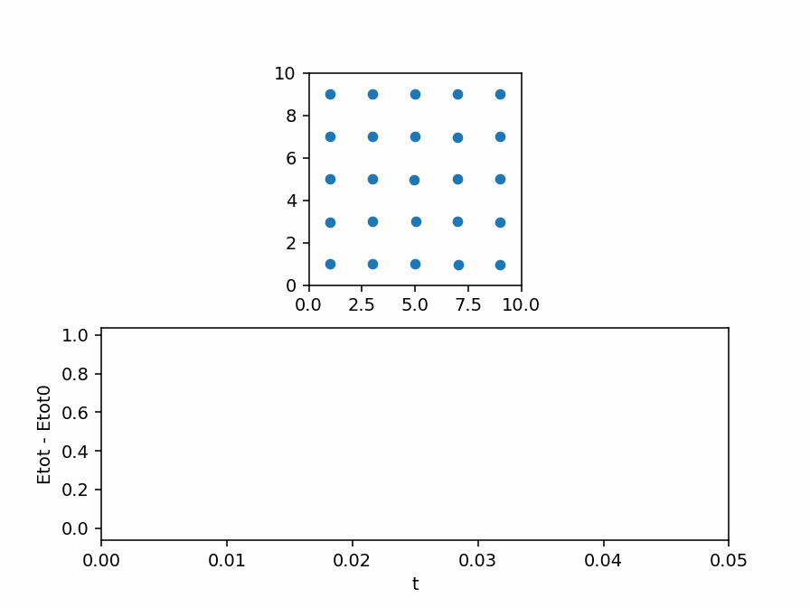
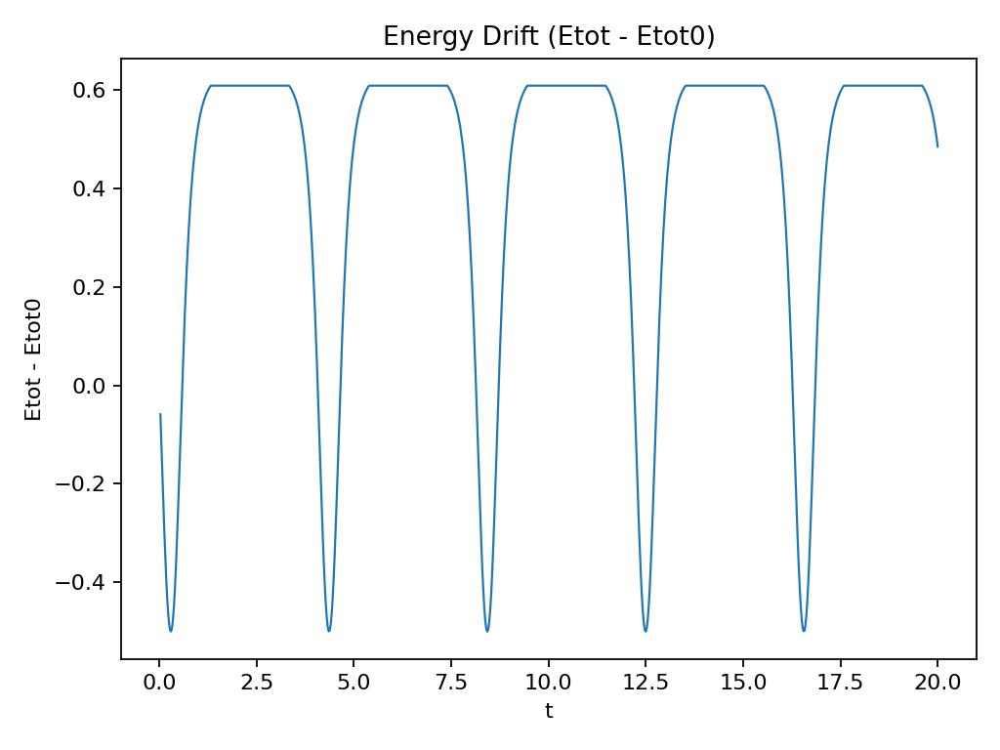

# Lennard-Jones Simulation (2D)

2D Molecular Dynamics (MD) simulation with Lennard-Jones interactions, periodic boundary conditions (PBC), and a Velocity-Verlet integrator.

It includes two modes:

- `--mode nve`: fixed `dt` (clean baseline to showcase energy conservation in a moderate regime).
- `--mode robust`: soft-core + force-based adaptive `dt` (aimed at not blowing up during close encounters/collisions).

## Requirements

- Python 3.9+
- `numpy`
- `matplotlib`

## Install

```bash
pip install -r requirements.txt
```

Optional (for GIF export):

```bash
pip install pillow
```

## How To Run

Example (N-particle gas in a box):

```bash
python simulation.py --scenario gas --mode nve --n 64 --box 10 --dt 2e-5 --steps 300000 --vmax 0.3
python simulation.py --scenario gas --mode robust --n 64 --box 10 --dt 2e-5 --steps 300000 --vmax 0.6
```

Example (2-particle head-on collision):

```bash
python simulation.py --scenario collision2 --mode nve --dt 5e-5 --steps 200000 --box 8 --vmax 0.5 --r0 1.5
python simulation.py --scenario collision2 --mode robust --dt 5e-5 --steps 200000 --box 8 --vmax 1.0 --r0 1.5
```

Outputs are saved to `outputs/`:

- `outputs/<prefix>_energy.png` (energy drift: `Etot - Etot0`)

## Physics Notes

- Integrator: Velocity-Verlet.
- PBC: minimum image convention.
- Lennard-Jones with cutoff and **potential shift** (potential energy is shifted so `V(rc)=0`).
- `--mode robust` uses a soft-core distance (`r_eff^2 = r^2 + a^2`) and a force-based adaptive `dt` that targets `dv ~ (Fmax/m)*dt` to avoid blow-ups.

## Useful Parameters

- `--rc`: cutoff radius in units of `sigma` (default 2.5).
- `--steps-per-frame` and `--plot-every`: speed up visualization without changing `dt`.
- `--a` (robust only): soft-core length in units of `sigma` (defaults to 0.6 in robust, 0.0 in nve).
- `--dv-target` and `--safety` (robust only): controls the aggressiveness of adaptive `dt`.

## Simulation Dynamics (Gas Scenario)



### Energy evolution (Two Particles Collision)


